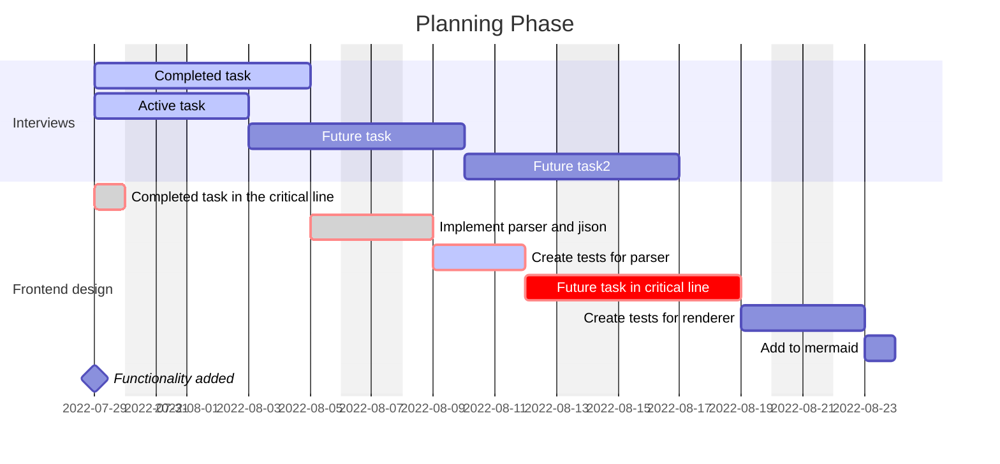

# Functional specification for project X

## General infos

### Executive summary

Include:
- Name of the Customer
- Project goal
- ...

### Project team

| Name | Role            |
| ---- | --------------- |
| Adam | Product Owner   |
| Max  | Developer       |
| John | Project manager |

### Stakeholders

| Name           | Role                         |
| -------------- | ---------------------------- |
| Jack Johnson   | CEO of JackJohnson Inc.      |
| Alan Carpenter | Chairman of JackJohnson Inc. |

---

## Customer requirements

### Goal of the project

~ A detailled description of the customer's requirement, including: ~

- WHO is involved? WHICH department requested the project?
- WHAT is to be achieved (describe the desired state AFTER the project)
- WHY is the project being ordered?
- WHEN are the deadlines?
  - Internal prototyping / testing
  - Integration testing with partners
  - Rollout

### Business impact

~ A brief description of how the project is planned to impact the client's strategic and operational work, value creation or KPI ~

> Note: Try not to include rigid KPI into the actual contract

### Detailled customer requirement

Describe the requirement in detail. Use tools such as:

- BPMN2
- Milestones & Epics

## Solution proposal

### Technology Stack

For example:
- Clientside Browser: React
- Clientside Mobile: React Native
- Backendside API: Nest.js
- Database Driver: Prisma ORM
- Database: Postgres

### Solution V1 features

### Solution VY non-features

---

## Time Frame

### Planning Phase

### Development Phase

### Go Live Phase